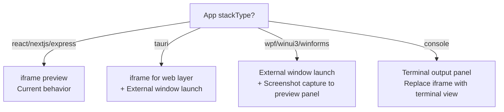

# Dyad Windows-Only App Builder - Implementation Plan

## Vision
Transform Dyad into a Windows-focused universal app builder:
- **Web Apps**: React, Next.js, Vue, Angular (current)
- **Windows Native Apps**: WPF, WinUI 3, WinForms, UWP, Console
- **Windows Desktop**: .NET MAUI (Windows-only mode), Tauri (Windows output)

**Scope:** Windows 10/11 only. No macOS or Linux support needed.

---

## Codebase Mapping: Plan Concepts to Actual Files

| Plan Concept | Actual Code That Needs Changing |
|---|---|
| `RuntimeProvider.scaffold()` | [`src/ipc/handlers/createFromTemplate.ts`](src/ipc/handlers/createFromTemplate.ts:12) — currently only handles `"react"` scaffold or GitHub clones |
| `RuntimeProvider.build()` | [`src/ipc/handlers/app_handlers.ts:2009`](src/ipc/handlers/app_handlers.ts:2009) — [`getCommand()`](src/ipc/handlers/app_handlers.ts:2009) currently defaults to npm |
| `RuntimeProvider.preview()` | [`src/components/preview_panel/PreviewIframe.tsx:1290`](src/components/preview_panel/PreviewIframe.tsx:1290) — hardcoded `<iframe>` |
| Process sandboxing | [`src/ipc/utils/process_manager.ts`](src/ipc/utils/process_manager.ts) — current process spawning |
| App execution | [`src/ipc/handlers/app_handlers.ts:159`](src/ipc/handlers/app_handlers.ts:159) — [`executeApp()`](src/ipc/handlers/app_handlers.ts:159) |
| App DB schema | [`src/db/schema.ts:26`](src/db/schema.ts:26) — `apps` table |
| AI instructions | [`src/prompts/system_prompt.ts:62`](src/prompts/system_prompt.ts:62) — hardcoded "web applications" |
| Dependency install | [`src/ipc/processors/executeAddDependency.ts`](src/ipc/processors/executeAddDependency.ts) — npm only |
| Response processing | [`src/ipc/processors/response_processor.ts`](src/ipc/processors/response_processor.ts) — only web tags |
| Agent tools | [`src/pro/main/ipc/handlers/local_agent/tool_definitions.ts`](docs/agent_architecture.md) — web-only tools |
| Guardian integration | [`src/ipc/handlers/guardian_handlers.ts`](src/ipc/handlers/guardian_handlers.ts) — existing Guardian IPC handlers |

---

## Architecture (Windows-Only)

```
┌─────────────────────────────────────────────────────────────┐
│                    Dyad Electron App                         │
│  ┌──────────────────────────────────────────────────────┐   │
│  │              RuntimeProvider Interface                │   │
│  │  scaffold() → build() → preview() → package()        │   │
│  └──────────────────────────────────────────────────────┘   │
├─────────────────────────────────────────────────────────────┤
│                    Execution Kernel                          │
│  ┌─────────────┐ ┌─────────────┐ ┌─────────────┐           │
│  │   Process   │ │  Capability │ │    Policy   │           │
│  │   Spawner   │ │   Engine    │ │   Engine    │           │
│  │  (Sandbox)  │ │ (JWT Tokens)│ │(Determinism)│           │
│  └─────────────┘ └─────────────┘ └─────────────┘           │
│  ┌─────────────┐ ┌─────────────┐ ┌─────────────┐           │
│  │    State    │ │   Resource  │ │    Shell    │           │
│  │   Manager   │ │  Governor   │ │   Gateway   │           │
│  │(Atomic Txn) │ │(CPU/Mem/IO) │ │(Controlled) │           │
│  └─────────────┘ └─────────────┘ └─────────────┘           │
├─────────────────────────────────────────────────────────────┤
│              Windows Implementation (ONLY)                   │
│  ┌─────────────────────────────────────────────────────┐    │
│  │  Guardian Service → Job Objects + WFP + ACL         │    │
│  └─────────────────────────────────────────────────────┘    │
└─────────────────────────────────────────────────────────────┘
```

**Key Advantage:** No cross-platform abstraction needed. Use Windows APIs directly.

---

## Phase 1: Guardian Integration & Hardening (Months 1-2)

### 1.1 Complete Guardian Integration

**Existing Guardian Code:** [`src/ipc/handlers/guardian_handlers.ts`](src/ipc/handlers/guardian_handlers.ts)

The Guardian Service becomes THE execution kernel. Extend the existing handlers rather than creating from scratch:

```typescript
// src/ipc/handlers/guardian_handlers.ts (EXISTING - extend these)
- guardianContracts.createJob        // Job Object creation
- guardianContracts.assignProcessToJob  // Process assignment
- guardianContracts.terminateJob     // Job termination
- guardianContracts.requestCapability   // JWT capability tokens
- guardianContracts.createWfpRule    // Windows Filtering Platform
```

**Integration Points for Node.js Sandboxing:**

```typescript
// src/ipc/handlers/app_handlers.ts - modify executeAppLocalNode()
async function executeAppLocalNode({
  appPath, appId, event, isNeon, installCommand, startCommand,
}: {
  appPath: string; appId: number; event: Electron.IpcMainInvokeEvent;
  isNeon: boolean; installCommand?: string | null; startCommand?: string | null;
}): Promise<void> {
  const settings = readSettings();
  const useGuardian = settings.useGuardianSandboxing ?? true;
  
  if (useGuardian) {
    // NEW: Use Guardian for sandboxed execution
    const job = await ipc.guardian.createJob({
      jobName: `dyad-app-${appId}`,
      memoryLimitBytes: 2 * 1024 * 1024 * 1024, // 2GB
      cpuRatePercent: 50,
      networkPolicy: 'allowed',
    });
    
    const proc = await ipc.guardian.spawnInJob('npm', ['run', 'dev'], job.id);
    // Monitor and enforce limits...
  } else {
    // FALLBACK: Existing direct spawn
    const spawnedProcess = spawn(command, [], { cwd: appPath, shell: true, stdio: "pipe" });
  }
}
```

### 1.2 Harden Node.js Builds

Extend [`src/ipc/utils/process_manager.ts`](src/ipc/utils/process_manager.ts) with Guardian integration:

```typescript
// src/ipc/utils/process_manager.ts
export interface RunningAppInfo {
  process: ChildProcess;
  processId: number;
  isDocker: boolean;
  containerName?: string;
  // NEW: Guardian job tracking
  guardianJobId?: string;
}

// NEW: Spawn with Guardian sandboxing
export async function spawnWithGuardian({
  command,
  args,
  cwd,
  appId,
  memoryLimitBytes,
}: SpawnOptions): Promise<RunningAppInfo> {
  const job = await ipc.guardian.createJob({
    jobName: `dyad-app-${appId}`,
    memoryLimitBytes,
    cpuRatePercent: 50,
    networkPolicy: 'allowed',
  });
  
  const proc = await ipc.guardian.spawnInJob(command, args, job.id);
  return { process: proc, processId: processCounter.increment(), isDocker: false, guardianJobId: job.id };
}
```

---

## Phase 2: Database Schema & Core Runtime (Months 2-3)

### 2.1 Database Migration

**File:** [`src/db/schema.ts`](src/db/schema.ts:26)

Add columns to the `apps` table (Dyad uses SQLite + Drizzle ORM, not YAML config):

```typescript
// src/db/schema.ts
export const apps = sqliteTable("apps", {
  id: integer("id").primaryKey({ autoIncrement: true }),
  name: text("name").notNull(),
  path: text("path").notNull(),
  createdAt: integer("created_at", { mode: "timestamp" }).notNull().default(sql`(unixepoch())`),
  updatedAt: integer("updated_at", { mode: "timestamp" }).notNull().default(sql`(unixepoch())`),
  
  // EXISTING columns (plan didn't acknowledge):
  installCommand: text("install_command"),
  startCommand: text("start_command"),
  
  // NEW columns for Windows app builder:
  stackType: text("stack_type").default("react"),     // "react" | "nextjs" | "express-react" | "wpf" | "winui3" | "winforms" | "console" | "maui" | "tauri"
  runtimeProvider: text("runtime_provider").default("node"), // "node" | "dotnet" | "tauri"
  
  // Existing columns...
  githubOrg: text("github_org"),
  githubRepo: text("github_repo"),
  // ... rest of existing columns
});
```

**Create Migration:**
```bash
npm run db:generate
```

### 2.2 DotNetProvider Implementation

**File:** [`src/ipc/handlers/createFromTemplate.ts`](src/ipc/handlers/createFromTemplate.ts:12)

Modify to support .NET templates:

```typescript
// src/ipc/handlers/createFromTemplate.ts
export async function createFromTemplate({
  fullAppPath,
  stackType = "react",        // NEW parameter
  runtimeProvider = "node",   // NEW parameter
}: {
  fullAppPath: string;
  stackType?: string;          // NEW
  runtimeProvider?: string;    // NEW
}) {
  if (runtimeProvider === "node") {
    // EXISTING: React/web templates
    const settings = readSettings();
    const templateId = settings.selectedTemplateId;
    if (templateId === "react") {
      await copyDirectoryRecursive(path.join(__dirname, "..", "..", "scaffold"), fullAppPath);
      return;
    }
    // GitHub clone logic...
  } else if (runtimeProvider === "dotnet") {
    // NEW: .NET templates
    await scaffoldDotNetTemplate({ stackType, fullAppPath });
  } else if (runtimeProvider === "tauri") {
    // NEW: Tauri templates
    await scaffoldTauriTemplate({ stackType, fullAppPath });
  }
}

// NEW function
async function scaffoldDotNetTemplate({
  stackType,
  fullAppPath,
}: {
  stackType: string;
  fullAppPath: string;
}) {
  const templateMap: Record<string, string> = {
    "wpf": "wpf",
    "winui3": "winui3",
    "winforms": "winforms",
    "console": "console",
    "maui": "maui",
  };
  
  const dotnetTemplate = templateMap[stackType];
  if (!dotnetTemplate) {
    throw new Error(`Unknown .NET template: ${stackType}`);
  }
  
  const projectName = path.basename(fullAppPath);
  const { execPromise } = await import("../processors/executeAddDependency");
  await execPromise(`dotnet new ${dotnetTemplate} -n "${projectName}" -o "${fullAppPath}"`);
}
```

**File:** [`src/ipc/handlers/app_handlers.ts`](src/ipc/handlers/app_handlers.ts:2009)

Modify `getCommand()` and `executeApp()` for .NET support:

```typescript
// src/ipc/handlers/app_handlers.ts - modify getCommand()
function getCommand({
  appId,
  installCommand,
  startCommand,
  runtimeProvider = "node",  // NEW parameter
  stackType = "react",       // NEW parameter
}: {
  appId: number;
  installCommand?: string | null;
  startCommand?: string | null;
  runtimeProvider?: string;   // NEW
  stackType?: string;         // NEW
}) {
  const hasCustomCommands = !!installCommand?.trim() && !!startCommand?.trim();
  if (hasCustomCommands) {
    return `${installCommand!.trim()} && ${startCommand!.trim()}`;
  }
  
  // NEW: Runtime-specific default commands
  if (runtimeProvider === "dotnet") {
    return getDotNetDefaultCommand({ stackType, appPath: "" }); // appPath determined at call site
  } else if (runtimeProvider === "tauri") {
    return getTauriDefaultCommand();
  }
  
  // EXISTING: Node default
  return getDefaultCommand(appId);
}

// NEW: .NET command builder
function getDotNetDefaultCommand({
  stackType,
  appPath,
}: {
  stackType: string;
  appPath: string;
}): string {
  switch (stackType) {
    case "wpf":
    case "winui3":
    case "winforms":
      return `dotnet build && dotnet run`;
    case "console":
      return `dotnet run`;
    case "maui":
      return `dotnet build -f net8.0-windows10.0.19041.0`;
    default:
      return `dotnet run`;
  }
}
```

### 2.3 App-Ready Detection for Native Apps

**File:** [`src/ipc/handlers/app_handlers.ts`](src/ipc/handlers/app_handlers.ts:343)

Currently detects app readiness by matching `localhost:PORT` in stdout. For native apps, extend the detection:

```typescript
// src/ipc/handlers/app_handlers.ts - modify listenToProcess()
function listenToProcess({
  process: spawnedProcess,
  appId,
  isNeon,
  event,
  runtimeProvider = "node",  // NEW
  stackType = "react",       // NEW
}: {
  process: ChildProcess;
  appId: number;
  isNeon: boolean;
  event: Electron.IpcMainInvokeEvent;
  runtimeProvider?: string;   // NEW
  stackType?: string;         // NEW
}) {
  spawnedProcess.stdout?.on("data", async (data) => {
    const message = util.stripVTControlCharacters(data.toString());
    
    // EXISTING: Node web app detection
    if (runtimeProvider === "node") {
      const urlMatch = message.match(/(https?:\/\/localhost:\d+\/?)/);
      if (urlMatch) {
        proxyWorker = await startProxy(urlMatch[1], { /* ... */ });
      }
    }
    
    // NEW: .NET native app detection
    if (runtimeProvider === "dotnet") {
      // WPF/WinForms: Process spawned successfully + no crash within 3s
      // Console: First stdout output
      if (stackType === "console" && message.length > 0) {
        safeSend(event.sender, "app:output", {
          type: "ready",
          message: "Console app started",
          appId,
        });
      }
    }
    
    // NEW: Tauri detection (has web layer)
    if (runtimeProvider === "tauri") {
      const urlMatch = message.match(/(https?:\/\/localhost:\d+\/?)/);
      if (urlMatch) {
        proxyWorker = await startProxy(urlMatch[1], { /* ... */ });
      }
    }
  });
  
  // NEW: For native apps, use process spawn success as readiness signal
  if (runtimeProvider === "dotnet" && stackType !== "console") {
    setTimeout(() => {
      if (spawnedProcess.exitCode === null) {
        safeSend(event.sender, "app:output", {
          type: "ready",
          message: "Native app started successfully",
          appId,
        });
      }
    }, 3000); // 3 second grace period
  }
}
```

### 2.4 System Prompt Architecture

**Files:** Create new prompt files, modify [`src/prompts/system_prompt.ts`](src/prompts/system_prompt.ts:62)

```
src/prompts/
├── system_prompt.ts          (modify role description conditionally)
├── local_agent_prompt.ts     (modify role description conditionally)
├── supabase_prompt.ts        (existing - keep for web apps)
├── dotnet_wpf_prompt.ts      (NEW)
├── dotnet_winui_prompt.ts    (NEW)
├── dotnet_winforms_prompt.ts (NEW)
├── dotnet_console_prompt.ts  (NEW)
└── tauri_prompt.ts           (NEW)
```

**Modify:** [`src/prompts/system_prompt.ts`](src/prompts/system_prompt.ts)

```typescript
// src/prompts/system_prompt.ts - modify constructSystemPrompt()
export const constructSystemPrompt = ({
  aiRules,
  chatMode = "build",
  enableTurboEditsV2,
  themePrompt,
  readOnly,
  basicAgentMode,
  stackType = "react",        // NEW parameter
  runtimeProvider = "node",   // NEW parameter
}: {
  aiRules: string | undefined;
  chatMode?: "build" | "ask" | "agent" | "local-agent" | "plan";
  enableTurboEditsV2: boolean;
  themePrompt?: string;
  readOnly?: boolean;
  basicAgentMode?: boolean;
  stackType?: string;          // NEW
  runtimeProvider?: string;    // NEW
}) => {
  // EXISTING code...
  
  let systemPrompt = getSystemPromptForChatMode({ chatMode, enableTurboEditsV2 });
  
  // NEW: Conditional role description based on stack type
  const roleDescription = getRoleDescriptionForStack({ stackType, runtimeProvider });
  systemPrompt = systemPrompt.replace("<role> You are Dyad, an AI editor that creates and modifies web applications.", roleDescription);
  
  systemPrompt = systemPrompt.replace("[[AI_RULES]]", aiRules ?? getDefaultAiRules({ stackType, runtimeProvider }));
  
  // NEW: Append stack-specific prompts
  if (runtimeProvider === "dotnet") {
    systemPrompt += "\n\n" + getDotNetPromptForStack(stackType);
  } else if (runtimeProvider === "tauri") {
    systemPrompt += "\n\n" + TAURI_PROMPT;
  }
  
  // Append theme prompt if provided
  if (themePrompt) {
    systemPrompt += "\n\n" + themePrompt;
  }
  
  return systemPrompt;
};

// NEW: Get role description based on stack
function getRoleDescriptionForStack({
  stackType,
  runtimeProvider,
}: {
  stackType: string;
  runtimeProvider: string;
}): string {
  if (runtimeProvider === "dotnet") {
    return `<role> You are Dyad, an AI editor that creates and modifies Windows desktop applications using .NET.`;
  } else if (runtimeProvider === "tauri") {
    return `<role> You are Dyad, an AI editor that creates and modifies desktop applications using Tauri (Rust + Web frontend).`;
  }
  return `<role> You are Dyad, an AI editor that creates and modifies web applications.`;
}

// NEW: Stack-specific AI rules
function getDefaultAiRules({
  stackType,
  runtimeProvider,
}: {
  stackType: string;
  runtimeProvider: string;
}): string {
  if (runtimeProvider === "dotnet") {
    return getDotNetAiRules(stackType);
  } else if (runtimeProvider === "tauri") {
    return TAURI_AI_RULES;
  }
  return DEFAULT_AI_RULES; // Existing web app rules
}
```

**New File:** `src/prompts/dotnet_wpf_prompt.ts`

```typescript
export const DOTNET_WPF_PROMPT = `
# .NET WPF Development

You are a Windows XAML expert for WPF applications.

## Tech Stack
- .NET 6/7/8
- WPF with XAML 2009
- MVVM pattern (Model-View-ViewModel)

## XAML Controls
- Button, TextBox, TextBlock, Label
- ListView, DataGrid, TreeView
- Navigation patterns with Frame
- Dialogs: OpenFileDialog, SaveFileDialog (Windows native)

## Data Binding
- Use {Binding} for XAML binding
- Implement INotifyPropertyChanged for ViewModels
- Use ObservableCollection<T> for lists

## Available Dyad Tags for WPF
- <dyad-write path="MainWindow.xaml"> - Write XAML files
- <dyad-write path="ViewModels/MainViewModel.cs"> - Write ViewModel classes
- <dyad-add-nuget packages="PackageName"> - Add NuGet packages
- <dyad-dotnet-command cmd="build"> - Run dotnet CLI commands

## Project Structure
MyWpfApp/
├── MyWpfApp.csproj
├── App.xaml
├── MainWindow.xaml          // You generate this
├── MainWindow.xaml.cs
├── ViewModels/              // MVVM ViewModels
│   └── MainViewModel.cs     // You generate this
└── Views/                   // Additional views
    └── UserControl1.xaml

## Windows APIs Available
- Windows.Storage (file access)
- Windows.UI.Notifications (toast notifications)
- Windows.ApplicationModel (packaging)

Generate production-ready WPF apps with proper MVVM separation, async/await for I/O, and Windows-native look and feel.
`;
```

---

## Phase 3: New Dyad Tags for .NET (Months 3-4)

### 3.1 New Dyad Tags

**File:** [`src/ipc/utils/dyad_tag_parser.ts`](src/ipc/utils/dyad_tag_parser.ts)

Add parsers for new tags:

```typescript
// src/ipc/utils/dyad_tag_parser.ts

// NEW: Parse <dyad-add-nuget packages="...">
export function getDyadAddNugetTags(fullResponse: string): string[] {
  const dyadAddNugetRegex = /<dyad-add-nuget packages="([^"]+)">[^<]*<\/dyad-add-nuget>/g;
  let match;
  const packages: string[] = [];
  while ((match = dyadAddNugetRegex.exec(fullResponse)) !== null) {
    packages.push(...unescapeXmlAttr(match[1]).split(" "));
  }
  return packages;
}

// NEW: Parse <dyad-dotnet-command cmd="...">
export function getDyadDotnetCommandTags(fullResponse: string): string[] {
  const dyadDotnetCommandRegex = /<dyad-dotnet-command cmd="([^"]+)"[^>]*>[\s\S]*?<\/dyad-dotnet-command>/g;
  let match;
  const commands: string[] = [];
  while ((match = dyadDotnetCommandRegex.exec(fullResponse)) !== null) {
    commands.push(unescapeXmlAttr(match[1]));
  }
  return commands;
}

// NEW: Parse <dyad-add-cargo-dependency packages="..."> (for Tauri)
export function getDyadAddCargoDependencyTags(fullResponse: string): string[] {
  const dyadAddCargoRegex = /<dyad-add-cargo-dependency packages="([^"]+)">[^<]*<\/dyad-add-cargo-dependency>/g;
  let match;
  const packages: string[] = [];
  while ((match = dyadAddCargoRegex.exec(fullResponse)) !== null) {
    packages.push(...unescapeXmlAttr(match[1]).split(" "));
  }
  return packages;
}
```

### 3.2 Response Processor Updates

**File:** [`src/ipc/processors/response_processor.ts`](src/ipc/processors/response_processor.ts)

Add processing for new tags:

```typescript
// src/ipc/processors/response_processor.ts
import {
  getDyadWriteTags,
  getDyadRenameTags,
  getDyadDeleteTags,
  getDyadAddDependencyTags,
  getDyadExecuteSqlTags,
  getDyadSearchReplaceTags,
  // NEW imports:
  getDyadAddNugetTags,
  getDyadDotnetCommandTags,
  getDyadAddCargoDependencyTags,
} from "../utils/dyad_tag_parser";

// NEW: Import NuGet execution
import { executeAddNuget } from "./executeAddNuget";
import { executeDotnetCommand } from "./executeDotnetCommand";

export async function processFullResponseActions(
  fullResponse: string,
  chatId: number,
  { chatSummary, messageId }: { chatSummary: string | undefined; messageId: number; }
): Promise<{ updatedFiles?: boolean; error?: string; extraFiles?: string[]; extraFilesError?: string; }> {
  // EXISTING code...
  
  // Extract all tags
  const dyadWriteTags = getDyadWriteTags(fullResponse);
  const dyadRenameTags = getDyadRenameTags(fullResponse);
  const dyadDeletePaths = getDyadDeleteTags(fullResponse);
  const dyadAddDependencyPackages = getDyadAddDependencyTags(fullResponse);
  const dyadExecuteSqlQueries = chatWithApp.app.supabaseProjectId ? getDyadExecuteSqlTags(fullResponse) : [];
  
  // NEW: Extract .NET specific tags
  const dyadAddNugetPackages = getDyadAddNugetTags(fullResponse);
  const dyadDotnetCommands = getDyadDotnetCommandTags(fullResponse);
  const dyadAddCargoPackages = getDyadAddCargoDependencyTags(fullResponse);
  
  // NEW: Handle NuGet package installation
  if (dyadAddNugetPackages.length > 0) {
    try {
      await executeAddNuget({
        packages: dyadAddNugetPackages,
        message: message,
        appPath,
      });
    } catch (error) {
      errors.push({
        message: `Failed to add NuGet packages: ${dyadAddNugetPackages.join(", ")}`,
        error: error,
      });
    }
    writtenFiles.push("*.csproj");
  }
  
  // NEW: Handle dotnet CLI commands
  for (const command of dyadDotnetCommands) {
    try {
      await executeDotnetCommand({ command, appPath });
    } catch (error) {
      errors.push({
        message: `Failed to execute dotnet command: ${command}`,
        error: error,
      });
    }
  }
  
  // EXISTING: File operations (writes, renames, deletes)...
}
```

### 3.3 New Processor Files

**New File:** `src/ipc/processors/executeAddNuget.ts`

```typescript
import { db } from "../../db";
import { messages } from "../../db/schema";
import { eq } from "drizzle-orm";
import { Message } from "@/ipc/types";
import { exec } from "node:child_process";
import { promisify } from "node:util";

export const execPromise = promisify(exec);

export async function executeAddNuget({
  packages,
  message,
  appPath,
}: {
  packages: string[];
  message: Message;
  appPath: string;
}) {
  const results: string[] = [];
  
  for (const packageName of packages) {
    const { stdout, stderr } = await execPromise(
      `dotnet add package ${packageName}`,
      { cwd: appPath }
    );
    results.push(stdout + (stderr ? `\n${stderr}` : ""));
  }
  
  const combinedResults = results.join("\n---\n");
  
  // Update the message content with the installation results
  const updatedContent = message.content.replace(
    new RegExp(
      `<dyad-add-nuget packages="${packages.join(" ")}">[^<]*</dyad-add-nuget>`,
      "g"
    ),
    `<dyad-add-nuget packages="${packages.join(" ")}">${combinedResults}</dyad-add-nuget>`
  );
  
  // Save the updated message back to the database
  await db
    .update(messages)
    .set({ content: updatedContent })
    .where(eq(messages.id, message.id));
}
```

---

## Phase 4: Preview Strategy (Months 4-5)

### 4.1 Preview Panel Architecture

**Files:**
- [`src/components/preview_panel/PreviewPanel.tsx`](src/components/preview_panel/PreviewPanel.tsx:147)
- [`src/components/preview_panel/PreviewIframe.tsx`](src/components/preview_panel/PreviewIframe.tsx:1290)



**Modify:** [`src/components/preview_panel/PreviewPanel.tsx`](src/components/preview_panel/PreviewPanel.tsx)

```typescript
// src/components/preview_panel/PreviewPanel.tsx
import { NativeAppPreview } from "./NativeAppPreview";   // NEW
import { ConsolePreview } from "./ConsolePreview";       // NEW

// Main PreviewPanel component
export function PreviewPanel() {
  const [previewMode] = useAtom(previewModeAtom);
  const selectedAppId = useAtomValue(selectedAppIdAtom);
  const app = useAtomValue(selectedAppAtom); // NEW: Get full app details
  
  // NEW: Determine preview strategy based on stack type
  const getPreviewComponent = () => {
    const runtimeProvider = app?.runtimeProvider ?? "node";
    const stackType = app?.stackType ?? "react";
    
    if (runtimeProvider === "node") {
      return <PreviewIframe key={key} loading={loading} />;
    } else if (runtimeProvider === "dotnet") {
      if (stackType === "console") {
        return <ConsolePreview appId={selectedAppId} />;
      } else {
        // WPF, WinUI 3, WinForms
        return <NativeAppPreview appId={selectedAppId} stackType={stackType} />;
      }
    } else if (runtimeProvider === "tauri") {
      // Tauri has web layer + native
      return <TauriPreview appId={selectedAppId} />;
    }
    return <PreviewIframe key={key} loading={loading} />;
  };
  
  return (
    <div className="flex flex-col h-full">
      <div className="flex-1 overflow-hidden">
        <PanelGroup direction="vertical">
          <Panel id="content" minSize={30}>
            <div className="h-full overflow-y-auto">
              {previewMode === "preview" ? (
                getPreviewComponent() // NEW: Dynamic preview component
              ) : previewMode === "code" ? (
                <CodeView loading={loading} app={app} />
              ) : previewMode === "configure" ? (
                <ConfigurePanel />
              ) : // ... other modes
            </div>
          </Panel>
        </PanelGroup>
      </div>
    </div>
  );
}
```

**New File:** `src/components/preview_panel/NativeAppPreview.tsx`

```typescript
// src/components/preview_panel/NativeAppPreview.tsx
import { useState, useEffect } from "react";
import { Button } from "@/components/ui/button";
import { Play, Square } from "lucide-react";
import { ipc } from "@/ipc/types";

interface NativeAppPreviewProps {
  appId: number;
  stackType: string;
}

export function NativeAppPreview({ appId, stackType }: NativeAppPreviewProps) {
  const [isRunning, setIsRunning] = useState(false);
  const [screenshot, setScreenshot] = useState<string | null>(null);
  
  const launchApp = async () => {
    await ipc.app.runNativeApp({ appId });
    setIsRunning(true);
    
    // Start screenshot capture loop
    startScreenshotCapture();
  };
  
  const stopApp = async () => {
    await ipc.app.stopNativeApp({ appId });
    setIsRunning(false);
  };
  
  const startScreenshotCapture = () => {
    // Capture screenshot every 2 seconds while app is running
    const interval = setInterval(async () => {
      try {
        const screenshotData = await ipc.app.captureNativeAppScreenshot({ appId });
        setScreenshot(screenshotData);
      } catch (error) {
        // App may have closed
        clearInterval(interval);
        setIsRunning(false);
      }
    }, 2000);
  };
  
  return (
    <div className="flex flex-col items-center justify-center h-full bg-gray-900 text-white p-4">
      {!isRunning ? (
        <div className="text-center">
          <p className="mb-4">{stackType.toUpperCase()} Application</p>
          <Button onClick={launchApp} className="flex items-center gap-2">
            <Play size={16} />
            Launch App
          </Button>
        </div>
      ) : (
        <div className="w-full h-full flex flex-col">
          <div className="flex justify-between items-center mb-4">
            <p>App is running</p>
            <Button onClick={stopApp} variant="destructive" className="flex items-center gap-2">
              <Square size={16} />
              Stop App
            </Button>
          </div>
          {screenshot && (
            
          )}
        </div>
      )}
    </div>
  );
}
```

**New File:** `src/components/preview_panel/ConsolePreview.tsx`

```typescript
// src/components/preview_panel/ConsolePreview.tsx
import { useState, useEffect, useRef } from "react";
import { Button } from "@/components/ui/button";
import { Play, Square, Terminal } from "lucide-react";
import { ipc } from "@/ipc/types";

interface ConsolePreviewProps {
  appId: number;
}

export function ConsolePreview({ appId }: ConsolePreviewProps) {
  const [isRunning, setIsRunning] = useState(false);
  const [output, setOutput] = useState<string[]>([]);
  const outputEndRef = useRef<HTMLDivElement>(null);
  
  useEffect(() => {
    // Listen for console output
    const unsubscribe = ipc.app.onAppOutput(({ appId: id, type, message }) => {
      if (id === appId) {
        setOutput(prev => [...prev, `[${type}] ${message}`]);
      }
    });
    
    return () => unsubscribe();
  }, [appId]);
  
  useEffect(() => {
    // Auto-scroll to bottom
    outputEndRef.current?.scrollIntoView({ behavior: "smooth" });
  }, [output]);
  
  const runApp = async () => {
    setOutput([]);
    await ipc.app.runApp({ appId });
    setIsRunning(true);
  };
  
  const stopApp = async () => {
    await ipc.app.stopApp({ appId });
    setIsRunning(false);
  };
  
  return (
    <div className="flex flex-col h-full bg-gray-900 text-white">
      <div className="flex items-center justify-between p-2 border-b border-gray-700">
        <div className="flex items-center gap-2">
          <Terminal size={16} />
          <span>Console Output</span>
        </div>
        {!isRunning ? (
          <Button onClick={runApp} size="sm" className="flex items-center gap-1">
            <Play size={14} />
            Run
          </Button>
        ) : (
          <Button onClick={stopApp} size="sm" variant="destructive" className="flex items-center gap-1">
            <Square size={14} />
            Stop
          </Button>
        )}
      </div>
      <div className="flex-1 overflow-auto p-2 font-mono text-sm">
        {output.length === 0 ? (
          <p className="text-gray-500">Click "Run" to start the console application...</p>
        ) : (
          output.map((line, i) => (
            <div key={i} className="whitespace-pre-wrap break-all">
              {line}
            </div>
          ))
        )}
        <div ref={outputEndRef} />
      </div>
    </div>
  );
}
```

---

## Phase 5: Template Selection UI (Months 5-6)

### 5.1 Project Type Selector

**File:** Modify app creation flow to include project type selector

```typescript
// src/components/app_creation/CreateAppDialog.tsx (NEW or existing)
import { useState } from "react";
import { Dialog, DialogContent, DialogHeader, DialogTitle } from "@/components/ui/dialog";
import { Button } from "@/components/ui/button";
import { RadioGroup, RadioGroupItem } from "@/components/ui/radio-group";
import { Label } from "@/components/ui/label";

const PROJECT_TYPES = [
  { id: "react", label: "React Web App", runtime: "node", icon: "⚛️" },
  { id: "nextjs", label: "Next.js Web App", runtime: "node", icon: "▲" },
  { id: "wpf", label: "WPF Desktop App", runtime: "dotnet", icon: "🪟" },
  { id: "winui3", label: "WinUI 3 Desktop App", runtime: "dotnet", icon: "🪟" },
  { id: "winforms", label: "WinForms Desktop App", runtime: "dotnet", icon: "🪟" },
  { id: "console", label: "Console Application", runtime: "dotnet", icon: "⌨️" },
  { id: "maui", label: ".NET MAUI (Windows)", runtime: "dotnet", icon: "📱" },
  { id: "tauri", label: "Tauri Desktop App", runtime: "tauri", icon: "🦀" },
];

export function CreateAppDialog({ open, onClose }: { open: boolean; onClose: () => void }) {
  const [selectedType, setSelectedType] = useState("react");
  const [appName, setAppName] = useState("");
  
  const createApp = async () => {
    const projectType = PROJECT_TYPES.find(t => t.id === selectedType);
    if (!projectType) return;
    
    await ipc.app.createApp({
      name: appName,
      stackType: projectType.id,
      runtimeProvider: projectType.runtime,
    });
    
    onClose();
  };
  
  return (
    <Dialog open={open} onOpenChange={onClose}>
      <DialogContent className="max-w-2xl">
        <DialogHeader>
          <DialogTitle>Create New App</DialogTitle>
        </DialogHeader>
        
        <div className="space-y-4">
          <div>
            <Label htmlFor="appName">App Name</Label>
            <input
              id="appName"
              value={appName}
              onChange={(e) => setAppName(e.target.value)}
              placeholder="MyApp"
              className="w-full mt-1"
            />
          </div>
          
          <div>
            <Label>Project Type</Label>
            <RadioGroup value={selectedType} onValueChange={setSelectedType} className="grid grid-cols-2 gap-4 mt-2">
              {PROJECT_TYPES.map((type) => (
                <div key={type.id} className="flex items-center space-x-2">
                  <RadioGroupItem value={type.id} id={type.id} />
                  <Label htmlFor={type.id} className="flex items-center gap-2 cursor-pointer">
                    <span>{type.icon}</span>
                    <span>{type.label}</span>
                  </Label>
                </div>
              ))}
            </RadioGroup>
          </div>
          
          <div className="flex justify-end gap-2">
            <Button variant="outline" onClick={onClose}>Cancel</Button>
            <Button onClick={createApp} disabled={!appName.trim()}>Create App</Button>
          </div>
        </div>
      </DialogContent>
    </Dialog>
  );
}
```

**File:** [`src/ipc/handlers/app_handlers.ts`](src/ipc/handlers/app_handlers.ts) - Modify `createApp` handler

```typescript
// src/ipc/handlers/app_handlers.ts
export function registerAppHandlers() {
  createTypedHandler(appContracts.createApp, async (_, params) => {
    const { name, stackType = "react", runtimeProvider = "node" } = params;  // NEW params
    const appPath = name;
    const fullAppPath = getDyadAppPath(appPath);
    
    if (fs.existsSync(fullAppPath)) {
      throw new Error(`App already exists at: ${fullAppPath}`);
    }
    
    // Create a new app with stack type and runtime provider
    const [app] = await db
      .insert(apps)
      .values({
        name,
        path: appPath,
        stackType,         // NEW
        runtimeProvider,   // NEW
      })
      .returning();
    
    // Create an initial chat for this app
    const [chat] = await db
      .insert(chats)
      .values({ appId: app.id })
      .returning();
    
    // Pass stack type and runtime provider to template creation
    await createFromTemplate({
      fullAppPath,
      stackType,         // NEW
      runtimeProvider,   // NEW
    });
    
    // Initialize git repo...
    
    return {
      app: { ...app, resolvedPath: fullAppPath },
      chatId: chat.id,
    };
  });
}
```

---

## Phase 6: Agent v2 Tool Additions (Months 6-7)

### 6.1 New Agent Tools for Native Apps

**File:** [`src/pro/main/ipc/handlers/local_agent/tool_definitions.ts`](src/pro/main/ipc/handlers/local_agent/tool_definitions.ts)

Add new tools for .NET development:

```typescript
// src/pro/main/ipc/handlers/local_agent/tools/run_dotnet_command.ts
import { z } from "zod";
import type { ToolDefinition } from "./types";
import { execPromise } from "@/ipc/processors/executeAddDependency";

export const runDotnetCommandTool: ToolDefinition = {
  name: "run_dotnet_command",
  description: "Execute a dotnet CLI command (build, run, add package, etc.)",
  inputSchema: z.object({
    command: z.string().describe("The dotnet command to run (e.g., 'build', 'run', 'add package Newtonsoft.Json')"),
    working_dir: z.string().optional().describe("Working directory for the command"),
  }),
  modifiesState: true,
  async execute({ command, working_dir }, ctx) {
    const cwd = working_dir || ctx.appPath;
    const { stdout, stderr } = await execPromise(`dotnet ${command}`, { cwd });
    return stdout + (stderr ? `\nStderr: ${stderr}` : "");
  },
  getConsentPreview({ command }) {
    return `Run: dotnet ${command}`;
  },
};

// src/pro/main/ipc/handlers/local_agent/tools/add_nuget_package.ts
import { z } from "zod";
import type { ToolDefinition } from "./types";

export const addNugetPackageTool: ToolDefinition = {
  name: "add_nuget_package",
  description: "Add a NuGet package to a .NET project",
  inputSchema: z.object({
    package_name: z.string().describe("Name of the NuGet package to add"),
    version: z.string().optional().describe("Specific version to install"),
    project_path: z.string().optional().describe("Path to .csproj file (default: finds first .csproj)"),
  }),
  modifiesState: true,
  async execute({ package_name, version, project_path }, ctx) {
    let cmd = `dotnet add ${project_path || "package"} package ${package_name}`;
    if (version) {
      cmd += ` --version ${version}`;
    }
    const { stdout, stderr } = await execPromise(cmd, { cwd: ctx.appPath });
    return stdout + (stderr ? `\nStderr: ${stderr}` : "");
  },
  getConsentPreview({ package_name, version }) {
    return `Add NuGet package: ${package_name}${version ? `@${version}` : ""}`;
  },
};

// src/pro/main/ipc/handlers/local_agent/tools/read_build_output.ts
import { z } from "zod";
import type { ToolDefinition } from "./types";
import fs from "node:fs";
import path from "node:path";

export const readBuildOutputTool: ToolDefinition = {
  name: "read_build_output",
  description: "Read MSBuild errors and warnings from build output",
  inputSchema: z.object({
    build_log_path: z.string().optional().describe("Path to build log file (default: searches for latest build output)"),
  }),
  modifiesState: false,
  async execute({ build_log_path }, ctx) {
    // Look for build errors in common locations
    const possiblePaths = [
      build_log_path,
      path.join(ctx.appPath, "msbuild.log"),
      path.join(ctx.appPath, "obj", "project.assets.json"),
    ].filter(Boolean);
    
    for (const logPath of possiblePaths) {
      if (fs.existsSync(logPath!)) {
        const content = fs.readFileSync(logPath!, "utf8");
        // Parse and format MSBuild errors
        const errors = content.match(/error [A-Z]+\d+:.*/g) || [];
        const warnings = content.match(/warning [A-Z]+\d+:.*/g) || [];
        return `Errors: ${errors.length}\n${errors.join("\n")}\n\nWarnings: ${warnings.length}\n${warnings.join("\n")}`;
      }
    }
    return "No build output found";
  },
};

// src/pro/main/ipc/handlers/local_agent/tools/launch_native_app.ts
import { z } from "zod";
import type { ToolDefinition } from "./types";
import { spawn } from "node:child_process";
import path from "node:path";

export const launchNativeAppTool: ToolDefinition = {
  name: "launch_native_app",
  description: "Launch the built native executable",
  inputSchema: z.object({
    executable_path: z.string().optional().describe("Path to executable (default: finds in bin/Debug or bin/Release)"),
    arguments: z.array(z.string()).optional().describe("Command line arguments to pass"),
  }),
  modifiesState: true,
  async execute({ executable_path, arguments: args }, ctx) {
    // Find the executable if not specified
    let exePath = executable_path;
    if (!exePath) {
      const possiblePaths = [
        path.join(ctx.appPath, "bin", "Debug", "net8.0-windows", "*.exe"),
        path.join(ctx.appPath, "bin", "Release", "net8.0-windows", "*.exe"),
      ];
      // Find first .exe
      const glob = await import("glob");
      for (const pattern of possiblePaths) {
        const matches = glob.globSync(pattern);
        if (matches.length > 0) {
          exePath = matches[0];
          break;
        }
      }
    }
    
    if (!exePath || !fs.existsSync(exePath)) {
      throw new Error("Could not find executable. Please build the project first.");
    }
    
    const proc = spawn(exePath, args || [], { detached: true });
    return `Launched: ${exePath} (PID: ${proc.pid})`;
  },
  getConsentPreview({ executable_path }) {
    return `Launch native app: ${executable_path || "auto-detect"}`;
  },
};
```

**File:** [`src/pro/main/ipc/handlers/local_agent/tool_definitions.ts`](src/pro/main/ipc/handlers/local_agent/tool_definitions.ts) - Register new tools

```typescript
// src/pro/main/ipc/handlers/local_agent/tool_definitions.ts
import { runDotnetCommandTool } from "./tools/run_dotnet_command";
import { addNugetPackageTool } from "./tools/add_nuget_package";
import { readBuildOutputTool } from "./tools/read_build_output";
import { launchNativeAppTool } from "./tools/launch_native_app";

export const TOOL_DEFINITIONS: readonly ToolDefinition[] = [
  // EXISTING tools...
  writeFileTool,
  editFileTool,
  searchReplaceTool,
  deleteFileTool,
  renameFileTool,
  addDependencyTool,
  executeSqlTool,
  readFileTool,
  listFilesTool,
  // ... other existing tools
  
  // NEW: .NET specific tools
  runDotnetCommandTool,
  addNugetPackageTool,
  readBuildOutputTool,
  launchNativeAppTool,
  
  // Plan mode tools
  planningQuestionnaireTool,
  writePlanTool,
  exitPlanTool,
];
```

---

## Phase 7: Packaging & Distribution (Months 7-9)

### 7.1 Windows Output Formats

| Format | Use Case | Command | Distribution |
|--------|----------|---------|--------------|
| Single-file .exe | Portable apps | `dotnet publish --self-contained -r win-x64 /p:PublishSingleFile=true` | Direct download |
| .msi | Enterprise deployment | WiX Toolset or MSBuild | SCCM, Group Policy |
| .msix | Microsoft Store | `msbuild /t:publish /p:AppxPackage=true` | Store, App Installer |
| Framework-dependent | .NET pre-installed | `dotnet publish` | Developers |

### 7.2 Windows Code Signing

```typescript
// src/ipc/handlers/packaging_handlers.ts (NEW)
import { ipcMain } from "electron";
import { exec } from "node:child_process";
import { promisify } from "node:util";

const execPromise = promisify(exec);

export function registerPackagingHandlers() {
  ipcMain.handle("package:sign", async (_, { binaryPath, certificatePath, password }) => {
    // Use signtool.exe for code signing
    const signtoolPath = "C:\\Program Files (x86)\\Windows Kits\\10\\bin\\10.0.19041.0\\x64\\signtool.exe";
    
    const command = `"${signtoolPath}" sign /f "${certificatePath}" /p "${password}" /tr http://timestamp.digicert.com /td sha256 /fd sha256 "${binaryPath}"`;
    
    const { stdout, stderr } = await execPromise(command);
    return { success: true, output: stdout + stderr };
  });
  
  ipcMain.handle("package:create-msix", async (_, { appPath, outputPath, publisher }) => {
    // Use MSBuild to create MSIX package
    const command = `msbuild "${appPath}" /t:publish /p:Configuration=Release /p:AppxPackage=true /p:PackageLocation="${outputPath}" /p:Publisher="${publisher}"`;
    
    const { stdout, stderr } = await execPromise(command, { cwd: appPath });
    return { success: true, output: stdout + stderr };
  });
}
```

---

## Timeline (Windows-Only)

```
Month  1  2  3  4  5  6  7  8  9
      ├─ Guardian + DB Schema ─┤
           ├─ Core Runtime ─┤
                ├─ Preview + Tags ─┤
                     ├─ UI + Agent Tools ─┤
                          ├─ Packaging ─┤
```

**Total: 9 months** (vs 18 months for cross-platform)

---

## Summary of Required Plan Changes (Addressed)

| # | Issue | Fix |
|---|-------|-----|
| 1 | No mapping to actual code files | Added file-level references throughout |
| 2 | No DB schema migration plan | Added `stackType`/`runtimeProvider` columns to [`apps`](src/db/schema.ts:26) table; acknowledged existing `installCommand`/`startCommand` |
| 3 | XAML prompt not integrated with prompt system | Defined new prompt files and conditional loading in [`system_prompt.ts`](src/prompts/system_prompt.ts) |
| 4 | No new dyad tags defined | Added `<dyad-add-nuget>`, `<dyad-dotnet-command>`, `<dyad-add-cargo-dependency>` with parsers |
| 5 | Preview strategy incomplete for non-web apps | Defined iframe vs. external window vs. terminal per stack type |
| 6 | No app-ready detection for native | Defined per-runtime detection strategies in [`app_handlers.ts`](src/ipc/handlers/app_handlers.ts:343) |
| 7 | `dyad.config.yaml` conflicts with SQLite architecture | Replaced with DB columns + existing Configure panel |
| 8 | Guardian integration too abstract | Referenced existing [`guardian_handlers.ts`](src/ipc/handlers/guardian_handlers.ts) handlers |
| 9 | No agent v2 tool additions | Defined `run_dotnet_command`, `add_nuget_package`, `read_build_output`, `launch_native_app` tools |
| 10 | No template selection UI described | Added project type selector component and modified [`createApp`](src/ipc/handlers/app_handlers.ts) handler |

---

## Next Steps

1. **Create database migration** for `stackType` and `runtimeProvider` columns
2. **Modify** [`createFromTemplate.ts`](src/ipc/handlers/createFromTemplate.ts) to support .NET scaffolding
3. **Add** new prompt files for .NET stacks
4. **Implement** new dyad tag parsers and processors
5. **Create** `NativeAppPreview` and `ConsolePreview` components
6. **Add** project type selector to app creation UI
7. **Implement** new agent tools for .NET development
